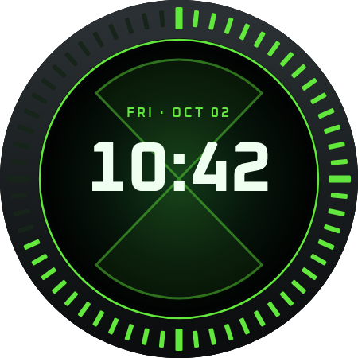
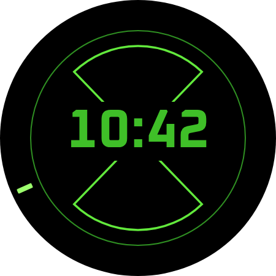

# Ultimatrix watch face: Watch Face Studio build guide

Step-by-step guide for building the Ultimatrix face in Samsung **Watch Face
Studio (WFS)** and installing it on a **Galaxy Watch4 (SM-R870)**.

 

Personal use only. Ben 10 belongs to Cartoon Network, so don't publish this
face to the Galaxy Store or Google Play.

---

## What's in this folder

| File | What it is |
|---|---|
| `layers/01_background.png` | Everything that never moves: black face, dark bezel, unlit seconds slots, green rim, glowing centre, faint hourglass |
| `layers/03_bezel_overlay.png` | The bezel again, with **see-through slots**. It goes *above* the seconds bar so the green only shows inside the slots |
| `layers/05_phone_icon_label.png` | The phone icon and the word PHONE under the battery % |
| `layers/aod_01_static.png` | Always-On: bright hourglass outline (with a gap behind the time) and thin green rim |
| `layers/aod_02_seconds_tick.png` | Always-On: one seconds mark pointing to 12, used as a seconds hand |
| `fonts/Oxanium-Bold.ttf`, `fonts/Oxanium-SemiBold.ttf` | The font (OFL licence in `fonts/OFL.txt`, free to use) |
| `preview/preview_active.png`, `preview/preview_aod.png` | What the finished face should look like. Use these to check your layout |
| `svg/` | Editable vector sources for every layer |
| `render-layers.js` | Script that regenerates `layers/`, `svg/` and `preview/` |

Every layer image is the full **450 × 450** size with its artwork already in
the right place. Put each one at **X 0, Y 0, width 450, height 450** and it
lines up on its own.

All coordinates below are on the 450 × 450 canvas, with (0, 0) at the top
left and the centre at (225, 225).

---

## 1. Set up the project

1. Unzip / copy this whole `ultimatrix` folder to your PC.
2. Open Watch Face Studio → **New Project** → shape **Circle** → name it
   `Ultimatrix`. Current WFS versions **don't ask for digital or analog**.
   The project starts empty (black circle, "No layers"), and the clock is
   added later as a component.
3. Check the canvas is round with background **#000000**. That's the Galaxy
   Watch4 44 mm screen (450 × 450).
4. Everything is added with the **+ Add Component** button (top centre of the
   window). Each new layer appears in the **layer list on the left**, and its
   position, size, font and colour are set in **Properties / Style on the
   right**.
5. **Install the fonts in Windows first.** WFS doesn't import fonts itself;
   it lists fonts installed on the PC. Right-click `fonts/Oxanium-Bold.ttf`
   → **Install**, same for `Oxanium-SemiBold.ttf`, then **restart WFS**.
   Font, size, colour and alignment are set in the **Properties** tab (text
   section) of a text or clock component, **not** the Style tab.
6. Menu names (current WFS): **+ Add Component** → Text, Preset image, Photo
   slot, Shape, Progress bar, Animation; *Time & Date*: Analog Clock,
   **Digital Clock ▸** (pick hour:minute), **ICU date and time** (for the
   date), Index, More; *Complication Slot*: Circle, Edge, Line, SmallBox,
   LargeBox.

**Tip for exact placement:** add `preview/preview_active.png` as a temporary
image layer on top at about 50% opacity. Line your text up with it, then
delete it before building.

---

## 2. Normal (wrist up) layers

Add these in order, bottom to top. In the WFS layer list the **top of the
list is the front**, so the last one added should end up highest.

### Layer 1: Background image
- **Image** component → `layers/01_background.png`
- X 0, Y 0, W 450, H 450

### Layer 2: Seconds bar (lights one slot per second)
Settings confirmed working in WFS on 2026-10-02:
- **Progress bar** component, Type **Circular progress bar**
- Placement **X 8, Y 8**; Dimension **W 434, H 434**
- Rotate **Angle 0**
- Colour **#62e83c** at 100%; **Background slider 0%** (hides the grey track)
- Cap style: **first (flat)** option; **Thickness 30**
- Range setting: **Value `[SEC]`** (seconds tag), **Min 0, Max 60**
- Range: **Start 357, Angular distance 360, Direction Clockwise**. Don't
  click the range preset icons; they turn it into a part circle and move
  the box. The 357 start makes the bar stop between slots, not halfway
  through one.
- In the editor it looks like a solid green ring until Layer 3 covers it.

### Layer 3: Bezel overlay
- **Image** component → `layers/03_bezel_overlay.png`
- X 0, Y 0, W 450, H 450
- Must be **above** the seconds bar in the layer list.

### Layer 4: Date
- **Text** (or Date) component
- Text box: X 75, Y 130, W 300, H 26, **centred**
- Content: short weekday, then ` · `, then short month, then 2-digit day.
  Build it with the tag picker; it should read like `FRI · OCT 02`.
  Use uppercase if WFS offers it; if not, `Fri · Oct 02` is fine.
- Font **Oxanium SemiBold**, size **17**, colour **#62E83C**, letter
  spacing about 3 (if available)

### Layer 5: Time
- **Digital clock** component, format **HH:mm** (24-hour; or follow the
  phone's setting if you prefer)
- Text box: X 45, Y 164, W 360, H 100, **centred**; the centre of the digits
  should sit at about (225, 214)
- Font **Oxanium Bold**, size **88**, colour **#EFFFF0**
- If WFS has a **glow** or **shadow** effect, add a soft green one
  (#62E83C). It's optional; the demo had a light glow.

### Layer 6: Phone icon and label
- **Image** component → `layers/05_phone_icon_label.png`
- X 0, Y 0, W 450, H 450

### Layer 7: Phone battery (complication slot)
- **Complication** component, type **Short text**
- Slot area: X 175, Y 288, W 100, H 30, text **centred** at about (225, 303)
- Text style: **Oxanium SemiBold**, size **26**, colour **#EFFFF0**
- Turn **off** the slot's own background, border and icon (the icon is
  already in Layer 6)
- **Default data:** if the default list includes **Phone battery**, pick it.
  Otherwise leave it empty and choose it on the watch later (section 5).
- Make sure the slot is **editable** (customizable) so you can pick the
  data on the watch.

---

## 3. Always-On layers

Switch the editor to **Always-on** (AOD) mode with the Always-on button in
the narrow icon strip next to the layer list (under the layers icon). WFS creates an automatic
Always-On version; **delete everything in it** and add only these:

### AOD 1: Static
- **Image** → `layers/aod_01_static.png`, X 0, Y 0, W 450, H 450

### AOD 2: Time
- **Digital clock**, HH:mm, same box as Layer 5 (X 45, Y 164, W 360, H 100, centred)
- Font **Oxanium Bold**, size **88**, colour **#3FBF28** (solid green)
- No glow

### AOD 3: Seconds mark (test this one)
- **Seconds hand** (analog hand) component → `layers/aod_02_seconds_tick.png`
- X 0, Y 0, W 450, H 450, **rotation centre (225, 225)**
- Most watch faces only redraw once a minute in Always-On mode, so this may
  freeze or WFS may not allow a seconds hand here. If WFS refuses it, skip
  it. If it builds but freezes on the watch, that's the system limit, not
  a mistake in your build.

**Brightness check:** this Always-On design lights about **9.5%** of the
screen. Samsung's guideline is about 15%. If WFS warns about the
Always-On pixel ratio, it should still be within the limit.

---

## 4. Install on the watch (Run on device)

1. On the watch: **Settings → About watch → Software → tap Software version
   5 times** to unlock Developer options.
2. **Settings → Developer options** → turn on **ADB debugging** and
   **Debug over Wi-Fi**. Note the IP address it shows.
3. Put the watch and PC on the **same Wi-Fi**.
4. In WFS click **Run on device**, connect to the watch (enter its IP if
   asked) and accept the prompt on the watch.
5. The face installs. On the watch, touch and hold the current face, swipe
   to **Ultimatrix** and select it.

---

## 5. Set up the phone battery slot

Watch faces made in WFS can't read the phone's battery by themselves. The
middle slot needs an app that offers a **Phone battery** complication.

1. Touch and hold the face → **Customize** → tap the middle slot.
2. If **Phone battery** is in the list, pick it. Done.
3. If not, install a phone-battery complication app on **both phone and
   watch** from the Play Store (search "phone battery complication"), open
   it once on the phone, then repeat step 1.
4. As a fallback, the slot can show the **watch** battery or anything else
   in the list.

---

## 6. Check it

- [ ] The seconds slots light up one by one and reset at the top of the minute
- [ ] Only the slots glow; no green shows on the solid parts of the bezel
- [ ] Date, time and battery line up with `preview/preview_active.png`
- [ ] Lower your wrist: Always-On shows only the hourglass, rim, time (and
      the seconds mark, if it's allowed)
- [ ] Always-On is readable but not too bright

Tell Claude what you see (photos help), especially:
- whether the Always-On seconds mark moves or freezes, and
- whether the phone battery shows up.

---

## Regenerating the images

Needs Node.js and Playwright with Chromium:

```
cd watch-faces/ultimatrix
NODE_PATH=$(npm root -g) node render-layers.js
```

Colours, sizes and positions are at the top of `render-layers.js`.
